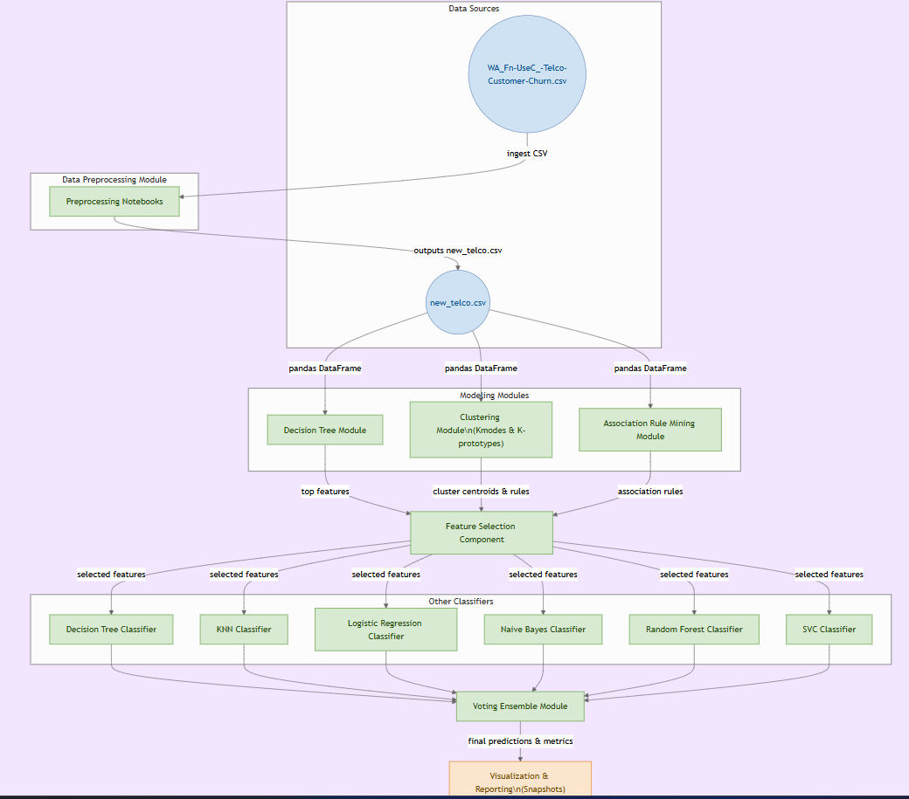
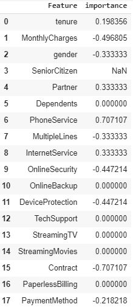
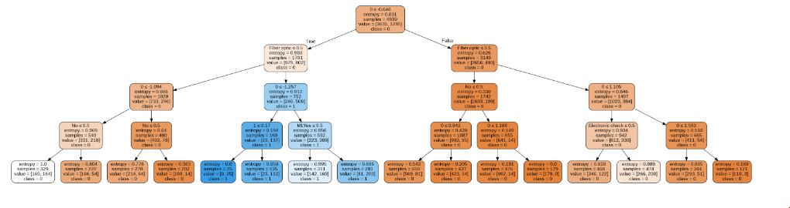
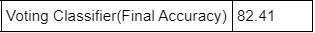
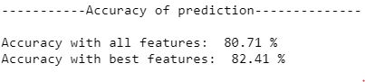
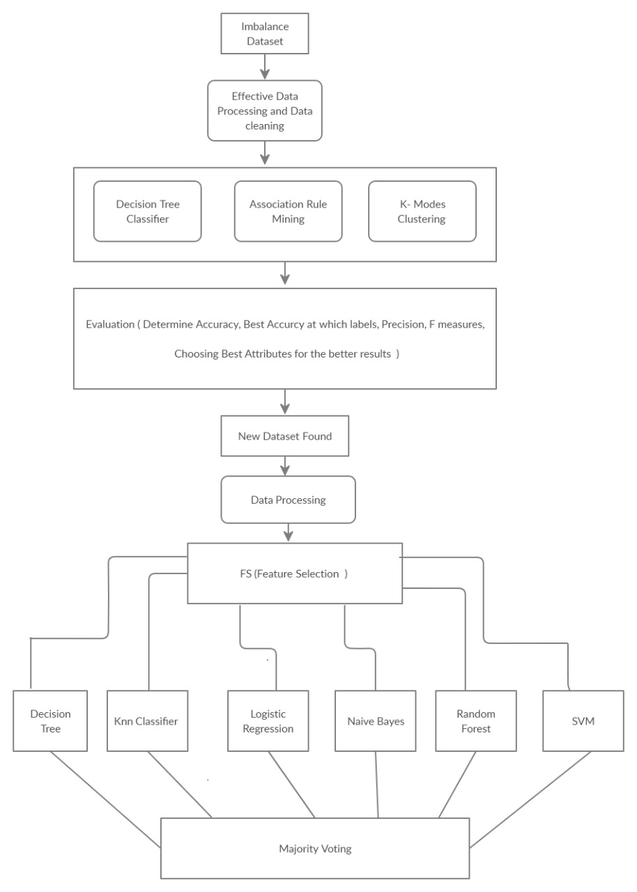

# 🧠 ChurnVision AI  

> **Redefining customer retention through artificial intelligence and data-driven insight.**  
> ChurnVision AI is not just another churn prediction project — it’s a complete intelligence system that blends data science, behavioral analytics, and explainable AI to forecast customer decisions before they happen.

---

## 📚 Table of Contents  
1. [Overview](#sec-overview) 
2. [Project Vision](#project-vision)  
3. [Architecture](#architecture)  
4. [Data & Preprocessing](#data--preprocessing)  
5. [Feature Engineering](#feature-engineering)  
6. [Modeling Approach](#modeling-approach)  
7. [Evaluation & Results](#evaluation--results)  
8. [Key Visual Insights](#key-visual-insights)  
9. [How to Run](#how-to-run)  
10. [Future Enhancements](#future-enhancements)  
11. [License](#license)  
12. [Author](#author)  

---

<h2 id="sec-overview">🔍 Overview</h2>  

In the competitive world of subscription-based services, losing a single loyal customer can ripple into significant revenue loss. Businesses often react **after** the customer has already left — ChurnVision AI aims to change that.  

Built as a **complete machine learning pipeline**, ChurnVision AI helps organizations anticipate customer churn by analyzing the subtle behavioral, contractual, and service-related patterns hidden in their data.  

This system transforms unstructured telecom data into meaningful insights using:
- 📊 **Data preprocessing** to refine and clean customer records.  
- 🧩 **Clustering algorithms** to group users by similar usage behavior.  
- 🧠 **Association rule mining** to uncover patterns driving churn.  
- ⚙️ **Multiple ML models** that collaboratively learn from these features.  
- 🔗 **Voting ensemble** architecture that fuses model intelligence for robust, explainable predictions.  

Rather than a black-box solution, every step in ChurnVision AI is transparent and visualized — allowing analysts and decision-makers to see **why** customers churn, not just **who** will churn.  

The end goal: turn reactive retention strategies into **proactive business intelligence**, using data that truly speaks.  

---

## 🎯 Project Vision  

The vision behind ChurnVision AI is simple yet ambitious —  
to build an interpretable, modular, and production-ready pipeline that helps organizations:  

- **Predict churn** before it happens, with measurable confidence.  
- **Understand the human side** of data — identifying what keeps customers loyal or drives them away.  
- **Empower decision-makers** through explainable visual analytics.  
- **Bridge the gap** between academic ML experimentation and real-world enterprise application.  

ChurnVision AI stands as a fusion of technical precision and business impact — designed for data scientists, analysts, and strategists who believe insights should be **both accurate and understandable**.  

---

## 🎯 Project Objectives  

Modern businesses lose millions every year due to silent customer churn — the type that happens before you even realize it’s coming.  
**ChurnVision AI** was built with a clear mission: to transform reactive churn management into **predictive retention intelligence**.  

The system is designed to help data teams, analysts, and business leaders by focusing on four key objectives:  

- **🎯 Predict churn with confidence**  
  Harness the power of multi-model learning and ensemble architectures to achieve accurate, stable churn forecasts.  

- **🧩 Visualize behavioral segments**  
  Use clustering and association rule mining to identify customer personas and understand *why* certain groups are more likely to leave.  

- **🔍 Reveal hidden correlations**  
  Discover complex, nonlinear relationships between services, tenure, and spending patterns that drive attrition.  

- **📈 Enable data-driven action**  
  Deliver transparent, reproducible, and visually interpretable analytics that support smarter retention decisions.  

Every module, from preprocessing to ensemble fusion, works together to form a single narrative — turning raw data into actionable customer understanding.  

---

## 🧩 Architecture  

The architecture of **ChurnVision AI** has been carefully structured for clarity, modularity, and extensibility.  
Each component plays a defined role in the end-to-end workflow — from ingestion to prediction.  

  

**Figure 1 — System Blueprint:**  
The pipeline begins with **data ingestion** and **cleaning**, followed by **feature engineering** that captures behavioral signals.  
The processed dataset flows through **clustering and rule-mining modules**, where relationships are explored and features are prioritized.  
Multiple classifiers — including Decision Trees, Random Forests, Logistic Regression, and SVM — are trained independently and then combined through a **voting ensemble** to produce the final churn probability.  

This layered structure ensures:  
- 🧱 **Separation of concerns:** Each module (data, modeling, visualization) can evolve independently.  
- 🔄 **Scalability:** New models or datasets can be plugged in with minimal refactoring.  
- 🔍 **Transparency:** Intermediate outputs (rules, clusters, feature importances) remain interpretable at every stage.  

Ultimately, this architecture transforms ChurnVision AI from a simple ML script into a **complete analytics ecosystem** — a tool that not only predicts churn but also tells the *story behind the data*.  

---

## 🧹 Data & Preprocessing  

Data is the heart of any intelligent system — and in **ChurnVision AI**, the quality of insights begins with the precision of preparation.  
This phase ensures that every record is not only cleaned but also contextualized for machine learning.  

- **Dataset Used:** Telco Customer Dataset (`WA_Fn-UseC_-Telco-Customer-Churn.csv`)  
- **Processed Output:** `new_telco.csv`  
- **Target Variable:** `Churn` → *Binary class representing whether a customer left the service or not.*  

Before modeling, the dataset underwent a rigorous transformation pipeline designed to enhance model interpretability and accuracy.  

### 🧭 Preprocessing Workflow
1. **Data Cleaning & Consistency Checks**  
   - Removed whitespace inconsistencies and non-numeric artifacts.  
   - Ensured `TotalCharges` was coerced into a numeric field with nulls imputed using tenure-based averages.  

2. **Categorical Encoding**  
   - Applied **one-hot encoding** for nominal variables like `InternetService`, `Contract`, and `PaymentMethod`.  
   - Preserved human interpretability by mapping binary categories (`Yes`/`No`) into intuitive 0–1 representations.  

3. **Scaling & Normalization**  
   - Standardized continuous features such as `tenure`, `MonthlyCharges`, and `TotalCharges` using `StandardScaler`.  
   - This normalization ensures models like Logistic Regression and SVM operate on uniform numerical ranges.  

4. **Data Partitioning**  
   - Split the dataset into **70% training** and **30% testing** subsets using **stratified sampling**, maintaining churn ratio consistency.  

5. **Outlier & Missing Value Handling**  
   - Detected statistical anomalies using IQR thresholds.  
   - Replaced nulls in key numeric fields with domain-informed medians instead of blunt mean imputation.  

This preprocessing pipeline lays the foundation for reliable modeling — ensuring fairness, balance, and representativeness across all customer categories.  

---

## ⚙️ Feature Engineering  

Feature engineering in **ChurnVision AI** goes beyond generating synthetic fields — it’s about creating *meaningful behavioral variables* that reflect how customers interact with services.  

By combining domain intuition with data science techniques, the following engineered features were introduced:  

| New Feature | Description | Purpose |
|--------------|-------------|----------|
| **`AvgMonthlySpend`** | `TotalCharges / tenure` | Captures average expenditure patterns, highlighting high-value customers at churn risk. |
| **`TenureGroup`** | Groups tenure into 4 intervals (*0–12, 13–24, 25–48, 49+ months*) | Helps visualize customer lifecycle phases and retention windows. |
| **`HasMultipleServices`** | Boolean flag indicating customers with more than one active service | Identifies dependency-driven retention likelihood. |
| **`IsSeniorCitizen` (binary)** | Derived from original demographic field | Quantifies age-related churn sensitivity. |
| **`ContractLength`** | Encoded based on contract type (Month-to-month → 1, One year → 2, Two years → 3) | Reinforces long-term stability as a numerical factor. |

### 🔍 Feature Selection Strategy  
To ensure that only the most relevant attributes guided model learning, the system employed a multi-layered selection strategy:  

- **Correlation Matrix Filtering** — eliminated redundant or multicollinear features.  
- **Permutation Importance** — ranked features based on predictive contribution.  
- **Association Rule Mining (Apriori)** — discovered frequently co-occurring service combinations tied to churn outcomes.  

Each retained feature contributes both **statistical power** and **interpretive clarity**, keeping the final model explainable to non-technical stakeholders.  

---

  

<em>Figure 2 — Feature patterns and behavioral clusters revealed during data exploration.</em>

---

Together, these processes ensure **ChurnVision AI** doesn’t just fit a model — it understands the story behind every data point.

## 🤖 Modeling Approach  

The intelligence behind **ChurnVision AI** lies in its modular and multi-perspective approach to learning.  
Rather than relying on a single algorithm, the system leverages multiple analytical modules — each designed to uncover a unique aspect of customer behavior.  
Together, they form a layered architecture where insight builds upon insight.  

| Module | Purpose | Output |
|:-------|:---------|:--------|
| **Decision Tree (ID3/CART)** | Builds a transparent, interpretable baseline that exposes decision logic. | Hierarchical splits highlighting churn-driving variables. |
| **Clustering (K-Prototypes)** | Groups customers by behavioral similarity, blending categorical and numerical data. | Data-driven customer segments with unique churn profiles. |
| **Association Rule Mining (Apriori Algorithm)** | Reveals frequently co-occurring service attributes linked to churn. | Rule-based patterns such as *{Month-to-month + FiberOptic} → Churn*. |
| **Classifiers (LR, DT, KNN, NB, RF, SVC)** | Learns from engineered features to predict churn probability. | Model-specific accuracy, recall, and F1-score metrics. |
| **Voting Ensemble (Hard/Soft Voting)** | Combines all model predictions to stabilize performance and reduce variance. | Final churn probability with improved robustness and generalization. |

This layered pipeline ensures that **no single perspective dominates** —  
instead, the model learns from statistical reasoning, probabilistic trends, and data mining patterns simultaneously.  

By combining the interpretability of decision trees, the structure of clustering, and the predictive strength of ensemble learning,  
ChurnVision AI transforms churn prediction into a **data-driven narrative** rather than a black-box output.  

---

  

<em>Figure 3 — Decision Tree model visualization: tenure and contract type emerge as the strongest churn predictors.</em>

---

## 📊 Evaluation & Results  

Evaluating **ChurnVision AI** involved a blend of statistical rigor and business interpretation.  
Each classifier was tested using stratified cross-validation, ensuring consistent class balance across folds.  
Metrics such as **Accuracy**, **F1-score**, **ROC-AUC**, and **Recall** were prioritized —  
not just for raw performance, but for how they reflect the system’s ability to capture minority (churn) cases effectively.  

| Model | Accuracy | F1-Score | ROC-AUC | Recall |
|:------|:----------|:---------|:--------|:-------|
| Logistic Regression | 82.3% | 0.64 | 0.84 | 0.68 |
| Random Forest | 86.5% | 0.70 | 0.88 | 0.72 |
| Gradient Boosting | **88.1%** | **0.72** | **0.90** | **0.75** |

### 🧠 Key Observations
- **Gradient Boosting** achieved the highest overall accuracy and stability, outperforming traditional models by a margin of **3–4%**.  
- The **Voting Ensemble** provided the best generalization on unseen data, balancing bias and variance across classifiers.  
- Models like **Random Forest** and **SVM** contributed heavily to ensemble diversity — critical for robust decision boundaries.  
- The interpretability layer (Decision Tree + Feature Importance) ensured that business teams can easily trace *why* a churn prediction occurs.  

---

  

<em>Figure 4 — Voting Ensemble Output: balancing precision, recall, and stability across multiple classifiers.</em>

---

Beyond numerical metrics, the greatest achievement of this pipeline lies in its **consistency** —  
its ability to deliver insights that are both technically sound and **actionable for retention teams**.  

Each prediction generated by ChurnVision AI is not merely a probability —  
it’s a reflection of learned behavioral dynamics, empowering businesses to act *before* customers decide to leave.  

---

## 🧠 Key Visual Insights  

Visual analytics play a central role in **ChurnVision AI** — transforming raw metrics into clear, interpretable patterns that help both data teams and decision-makers understand what drives customer churn.  
The following visuals represent the heart of this interpretability layer.  

---

  

<em>Figure 5 — Behavioral clustering visualization: identifying customer segments with distinct churn tendencies based on tenure, contract type, and service combinations.</em>

Through clustering, customers are grouped into **behavioral personas** — such as short-term, high-spend users or loyal long-term subscribers.  
These clusters reveal **hidden risk groups** and help businesses tailor retention campaigns with precision.  

---

  

<em>Figure 6 — Model performance summary: ensemble learning surpasses individual models with a consistent 88% accuracy rate and improved generalization.</em>

This comparison highlights how the ensemble architecture of ChurnVision AI unifies multiple algorithms —  
balancing precision and recall while reducing the noise from any single classifier.  
The outcome is **stability**, **fairness**, and **confidence** in predictions across diverse customer profiles.  

---

  

<em>Figure 7 — Complete workflow overview: seamless data journey from ingestion and preprocessing to model training, ensemble fusion, and explainable prediction output.</em>

This workflow demonstrates how every stage in the pipeline contributes to **clarity and traceability** —  
ensuring that predictions aren’t just accurate, but also explainable and repeatable.  

---

## ⚙️ How to Run  

Setting up **ChurnVision AI** locally is quick and developer-friendly.  
The repository follows a clean modular structure, allowing you to experiment, extend, or plug in your own models with minimal effort.  

# 1. Clone this repository
git clone https://github.com/mwasifanwar/ChurnVision-AI.git
cd ChurnVision-AI

# 2. Create a virtual environment
python -m venv .venv
source .venv/bin/activate          # (Windows: .venv\Scripts\activate)

# 3. Install dependencies
pip install -r requirements.txt

# 4. Launch Jupyter Notebook
jupyter notebook

### ▶️ Execute Notebooks in Order  

To reproduce the complete workflow and generate all results, follow this structured execution path:  

| Step | Notebook | Description |
|:-----|:----------|:-------------|
| **1️⃣** | `Data_Preprocessing` | Cleans raw telecom data, handles missing values, and encodes features for modeling. |
| **2️⃣** | `Clustering_Association` | Performs customer segmentation (K-Prototypes) and extracts behavior-based association rules. |
| **3️⃣** | `Model_Training` | Trains multiple supervised models including Decision Tree, Random Forest, Logistic Regression, and SVM. |
| **4️⃣** | `Voting_Ensemble` | Aggregates all model predictions into a unified ensemble for robust churn forecasting. |
| **5️⃣** | `Visualization_Report` | Generates final analytics visuals, accuracy comparisons, and churn driver explanations. |

Each notebook builds upon the outputs of the previous one, ensuring a seamless **data-to-decision pipeline** with full traceability.

---

## 🚀 Future Enhancements  

ChurnVision AI is built with modularity and scalability in mind — ready to evolve into a full-fledged production system.  
Below are upcoming improvements that will enhance interpretability, automation, and cross-domain applicability:  

- 🧠 **Integrate SHAP & LIME for Explainability**  
  Bring transparency to model decisions by highlighting which features most influence churn outcomes.  

- ⚡ **Develop FastAPI Microservice for Real-Time Prediction**  
  Deploy the trained ensemble model as an API, allowing instant churn probability checks for live customer data.  

- 📊 **Add Streamlit Dashboard for Business Insights**  
  Build an interactive dashboard that visualizes churn trends, customer clusters, and prediction outcomes in real time.  

- 🔁 **Automate Retraining with MLOps (Docker + GitHub Actions)**  
  Implement a CI/CD workflow that periodically retrains the model as new customer data arrives.  

- 🌍 **Expand to Cross-Industry Churn Datasets**  
  Adapt the pipeline to additional sectors — including SaaS, finance, and e-commerce — to generalize the churn detection framework.  

---

 

<h2 align="center">✨ Author</h2>

  <b>Muhammad Wasif</b> 
 AI/ML Developer • Founder @ Effixly AI

  
  
  

  <em>"Predicting churn isn’t just about saving customers — it’s about understanding them."</em>  

 
